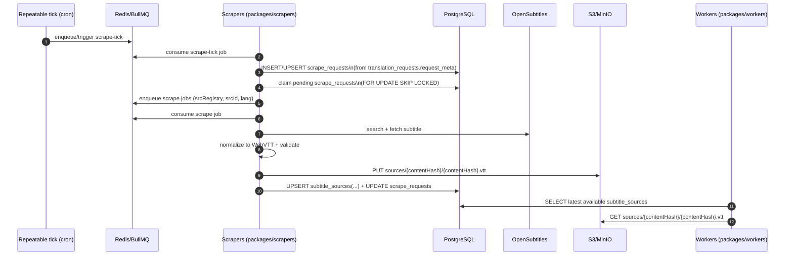
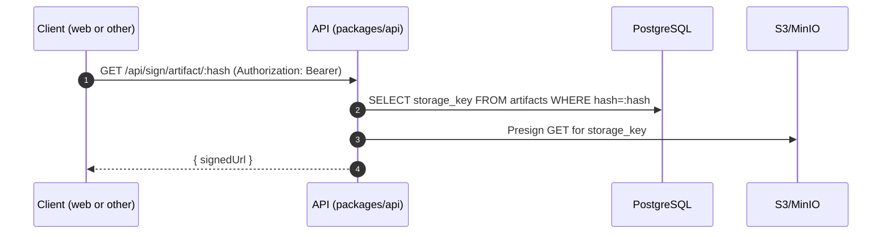

# Package Communication & Connectivity

This document explains how each package in the monorepo connects at runtime (network calls, database access, queues, and storage) and how they fit together end-to-end.

> Mermaid diagrams render on GitHub and most Markdown viewers that support Mermaid.

## Packages (what runs)

- **`packages/web`**: Next.js web app (dashboard + marketing). Talks to the API over HTTP.
- **`packages/api`**: Fastify REST API. Owns auth, credits, add-on integration, artifact signing, and enqueueing background work.
- **`packages/addon`**: Stremio add-on server. Implements Stremio’s `subtitles` resource and delegates work to the API.
- **`packages/workers`**: BullMQ workers for translation pipeline. Consumes jobs from Redis and writes artifacts to S3 + Postgres.
- **`packages/scrapers`**: BullMQ workers for subtitle source scraping. Periodically discovers work from the DB and fetches baseline sources from OpenSubtitles.
- **`packages/shared`**: Shared Zod schemas + utilities (hashing, VTT normalization/validation). This package is a _build-time dependency_ (not a runtime service).
- **`packages/e2e`**: Playwright E2E tests. Drives the web UI and calls the API as part of test flows.

## Infrastructure services (what packages depend on)

- **PostgreSQL**: system of record (users, wallets, artifacts, translation requests, scrape requests, etc.)
- **Redis**: BullMQ backing store (queues for workers + scrapers)
- **S3/MinIO**: subtitle storage (artifacts + scraped source baselines)

## Package map (who talks to whom)

```mermaid
flowchart LR
  %% Clients
  subgraph Clients
    BR[Browser]
    ST[Stremio Client]
    PW[Playwright Runner]
  end

  %% Runtime services
  subgraph Packages
    WEB[packages/web\nNext.js]
    API[packages/api\nFastify REST]
    ADDON[packages/addon\nAddon HTTP server]
    WORKERS[packages/workers\nBullMQ workers]
    SCRAPERS[packages/scrapers\nBullMQ scrapers]
    E2E[packages/e2e\nPlaywright tests]
    SHARED[packages/shared\n(schemas/utils)]
  end

  %% Infra
  subgraph Infra
    PG[(PostgreSQL)]
    REDIS[(Redis / BullMQ)]
    S3[(S3/MinIO)]
  end

  %% External providers
  subgraph External
    OS[OpenSubtitles]
    LLM[LLM APIs\n(OpenAI / Gemini / DeepL)]
  end

  %% Edges
  BR -->|HTTPS| WEB
  WEB -->|HTTP REST + JWT| API

  ST -->|HTTP addon protocol| ADDON
  ADDON -->|HTTP REST\n(x-addon-token or JWT)| API

  API -->|SQL| PG
  API -->|Presign / PUT / GET| S3
  API -->|enqueue translate jobs| REDIS

  WORKERS -->|consume translate jobs| REDIS
  WORKERS -->|SQL| PG
  WORKERS -->|GET baseline / PUT artifact| S3
  WORKERS -->|HTTP| LLM
  WORKERS -->|HTTP download source subtitle| OS

  SCRAPERS -->|consume scrape-tick & scrape jobs| REDIS
  SCRAPERS -->|SQL| PG
  SCRAPERS -->|PUT baseline source| S3
  SCRAPERS -->|HTTP| OS

  PW -->|drives browser| WEB
  E2E -->|runs| PW

  %% Build-time dependency edges
  SHARED -.-> WEB
  SHARED -.-> API
  SHARED -.-> WORKERS
  SHARED -.-> SCRAPERS
```

## Core runtime flows

### 1) Stremio add-on flow: ensure subtitles exist (cache/import/translate)

The Stremio client talks only to the add-on server. The add-on server calls the API to “ensure” a subtitle is available. The API either returns an existing artifact, imports a ready-made subtitle from OpenSubtitles, or enqueues a translation job.

```mermaid
sequenceDiagram
  autonumber
  participant ST as Stremio Client
  participant AD as Addon (packages/addon)
  participant API as API (packages/api)
  participant PG as PostgreSQL
  participant OS as OpenSubtitles
  participant R as Redis/BullMQ
  participant W as Workers (packages/workers)
  participant S3 as S3/MinIO
  participant LLM as LLM Provider

  ST->>AD: GET /subtitles/:type/:id.json (addon config)
  AD->>API: POST /api/addon/ensure\n(x-addon-token OR Authorization: Bearer)

  API->>PG: SELECT artifacts by (src_registry, src_id, dst_lang)

  alt Cache hit (artifact exists)
    API->>S3: Presign GET artifacts/{hash}/{hash}.vtt
    API-->>AD: {status: completed, subtitles:[signedUrl]}
    AD-->>ST: {subtitles:[{url,lang}]}
  else Cache miss
    API->>OS: Search target subtitle (dstLang)

    alt Import available
      API->>S3: PUT artifacts/{hash}/{hash}.vtt
      API->>PG: INSERT artifacts(... model=import ...)
      API->>S3: Presign GET artifacts/{hash}/{hash}.vtt
      API-->>AD: {status: completed, subtitles:[signedUrl], imported:true}
      AD-->>ST: {subtitles:[{url,lang}]}
    else Needs LLM translation
      API->>OS: Search source subtitle (en)
      API->>PG: UPSERT translation_requests(user_id, artifact_hash, request_meta)
      API->>R: translateQueue.add("translate", {sourceSubtitle:url,...})
      API-->>AD: {status: processing, subtitles:[]}
      AD-->>ST: {subtitles:[]}

      W->>R: consume translate job
      W->>PG: (optional) lookup subtitle_sources baseline
      W->>S3: (optional) GET sources/{contentHash}.vtt
      W->>OS: (if sourceSubtitle is URL) download subtitle
      W->>W: normalize to WebVTT (ingest)
      W->>LLM: translate(WebVTT cues)
      W->>S3: PUT artifacts/{hash}/{hash}.vtt
      W->>PG: INSERT artifacts(...)
    end
  end

  Note over ST,AD: Stremio typically retries later;\nnext call becomes a cache hit once artifacts exist.
```

**Auth used by the add-on**

- The add-on can authenticate to the API with either:
  - `x-addon-token` (opaque install token minted by the API), or
  - a user JWT + `dstLang` provided via add-on config.

### 2) Scrapers flow: build a “baseline” source-subtitle cache

Scrapers exist to fetch and store source subtitles (baseline) so translations can use an internal cached source instead of repeatedly downloading from OpenSubtitles.



### 3) Artifact serving flow: signed URLs

Translated artifacts live in S3/MinIO. The API’s signing route checks Postgres for the artifact’s storage key and then generates a time-limited pre-signed GET URL.



## Communication matrix (summary)

| From                | To                              | How                           | Purpose                                                              |
| ------------------- | ------------------------------- | ----------------------------- | -------------------------------------------------------------------- |
| `packages/web`      | `packages/api`                  | HTTP (REST + JWT)             | Auth, wallet/credits, add-on install token, translation APIs         |
| `packages/addon`    | `packages/api`                  | HTTP (`x-addon-token` or JWT) | Ensure subtitles; returns signed URLs or processing                  |
| `packages/api`      | Postgres                        | SQL (`pg`)                    | Users, wallets, artifacts, translation_requests, addon_installations |
| `packages/api`      | Redis/BullMQ                    | BullMQ enqueue                | Enqueue translation jobs (`translate` queue)                         |
| `packages/api`      | S3/MinIO                        | AWS SDK                       | Store imported subtitles; presign artifact downloads                 |
| `packages/workers`  | Redis/BullMQ                    | BullMQ consume                | Translation jobs (and local pipeline queues inside workers process)  |
| `packages/workers`  | LLM providers                   | HTTPS                         | Translate WebVTT text                                                |
| `packages/workers`  | Postgres + S3                   | SQL + AWS SDK                 | Store artifacts; optionally read baseline sources                    |
| `packages/scrapers` | Redis/BullMQ                    | BullMQ consume                | Scheduled scraping + scrape jobs                                     |
| `packages/scrapers` | OpenSubtitles                   | HTTPS                         | Discover/download source subtitles                                   |
| `packages/scrapers` | Postgres + S3                   | SQL + AWS SDK                 | Persist baseline sources for reuse                                   |
| `packages/e2e`      | `packages/web` / `packages/api` | Playwright + HTTP             | End-to-end testing                                                   |

## Notes / “sharp edges” you should know about

- The add-on translation path (`/api/addon/ensure`) uses BullMQ (`translate` queue) and is wired end-to-end with `packages/workers`.
- The general `/api/translations` endpoint currently records a row in a `jobs` table on cache miss (rather than enqueueing BullMQ). If you intend it to run through the same worker pipeline, it should enqueue BullMQ similarly to the add-on flow.
